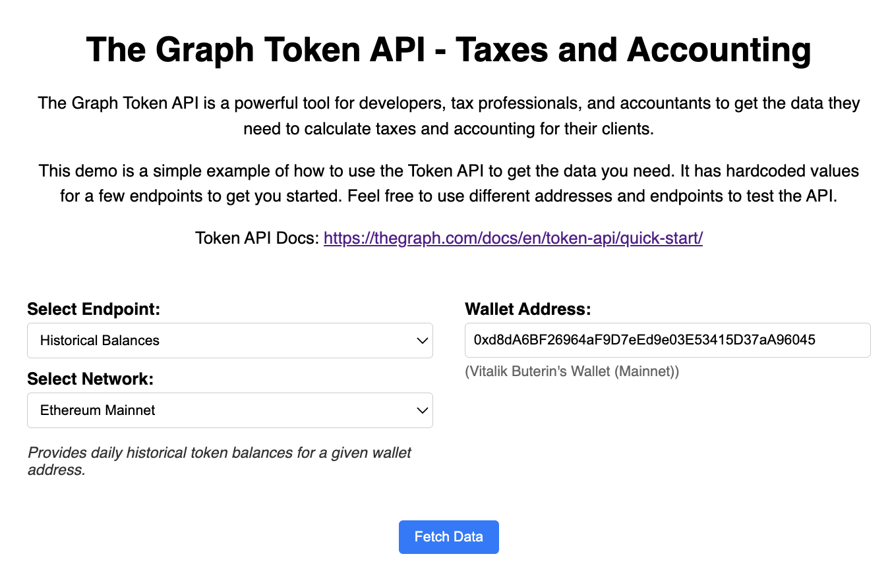

# The Graph Token API — Taxes & Accounting Usecase

Token API Docs: https://thegraph.com/docs/en/token-api/quick-start/

> **Audience:** Tax advisors, CPAs, accounting teams, and back-office engineers who need reliable on-chain token data for compliance, reporting, and audit purposes.

This repo shows how to pull **wallet balances, historical inventory snapshots, transfers, holders lists, DEX swaps and price candles** from **The Graph Token API** with nothing more than a browser and a local Node process.

The demo is intentionally lightweight—just plain **HTML, CSS, JavaScript, and a 40-line Express proxy**—so that non-front-end developers can copy/paste the parts they need into an existing workflow (Excel, Airtable, PowerBI, QuickBooks import, etc.).

---
## Why you might need this

| Tax / Accounting Task | How the Token API helps |
| --------------------- | ----------------------- |
| End-of-year token inventory valuation | `historical_balances` gives you a snapshot for **any past day**. |
| Capital gains calculation | Combine `transfers` (cost basis) with `OHLC` price endpoints. |
| Proof-of-reserves / audit schedules | Use `balances` + `holders` to reconcile holdings at a given block. |
| DAO / Treasury reporting | Fetch `balances` across multiple wallets and networks in one place. |

---
## 5-Minute Quick Start

1. **Clone & install**
   ```bash
   git clone https://github.com/your-org/tokenapi-demo.git
   cd tokenapi-demo
   npm install
   ```
2. **Run the local proxy** (avoids CORS issues)
   ```bash
   npm start          # serves at http://localhost:3001
   ```
3. **Open the demo**
   Navigate to **http://localhost:3001** and click "Fetch Data".  You will see live JSON plus an auto-generated table or candlestick chart.


---
## How the pieces fit together

| File | Purpose |
| ---- | ------- |
| `index.html` | Minimal UI with endpoint + network selectors. |
| `style.css`  | Basic responsive styling, capped at 800 px for readability. |
| `script.js`  | All the logic: builds the Token API URL, calls it through `/proxy`, and renders either raw JSON, an HTML table, or a candlestick chart (Lightweight-Charts). |
| `server.js`  | Tiny Express proxy so the browser can call the Token API without CORS headaches. |

---
## Supported Endpoints (Staging)

| Endpoint | Typical Tax Use | Example |
| -------- | --------------- | ------- |
| `/balances` | End-of-period inventory | `/balances/evm/0x…?network_id=mainnet` |
| `/historical/balances` | FIFO / LIFO cost basis | `/historical/balances/evm/0x…?network_id=base` |
| `/transfers` | Realised gains, audit trails | `/transfers/evm?from=0x…&network_id=matic` |
| `/holders` | Airdrop or dividend snapshots | `/holders/evm/0xTOKEN?network_id=optimism` |
| `/ohlc` | Fair-market valuation (FMV) | `/ohlc/prices/evm/0xTOKEN?interval=1d` |

---
## Coming soon 🚧

We are actively turning this demo into two **drag-and-drop integration options**:

1. **`@thegraph/token-api-client` (npm)** — a 5 kB helper that wraps all endpoints with TypeScript types and optional proxy support.
2. **`@thegraph/token-api-widget` (Web Component)** — drop one script tag:
   ```html
   <script src="https://unpkg.com/@thegraph/token-api-widget"></script>
   <token-api-viewer endpoint="historical_balances"
                     network-id="mainnet"
                     address="0xd8dA6BF…96045"></token-api-viewer>
   ```

Follow the **Releases** tab or watch the repo to get notified when these land.

---
## Contributing / Questions

• File an issue if something is unclear for tax workflows.  
• PRs that add CSV export, QuickBooks import, or common jurisdiction templates are very welcome.

‣ **License**: MIT — use it in client engagements freely.

